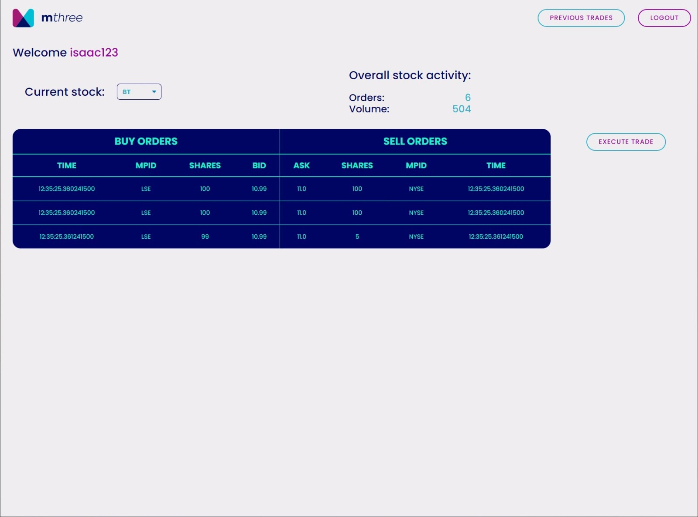

# SORT

SORT is a simulated order’s match making web app, developed
as part of investment banking training. Main features
include login, custom order creation by filling Buy or Sell side, Shares quantity, ASK or BID price and securities identifier (MPID).
The main scope of the project is to match user’s buy or sell order by the best BID or ASK price amongst multiple
exchanges or demo venues.

 
